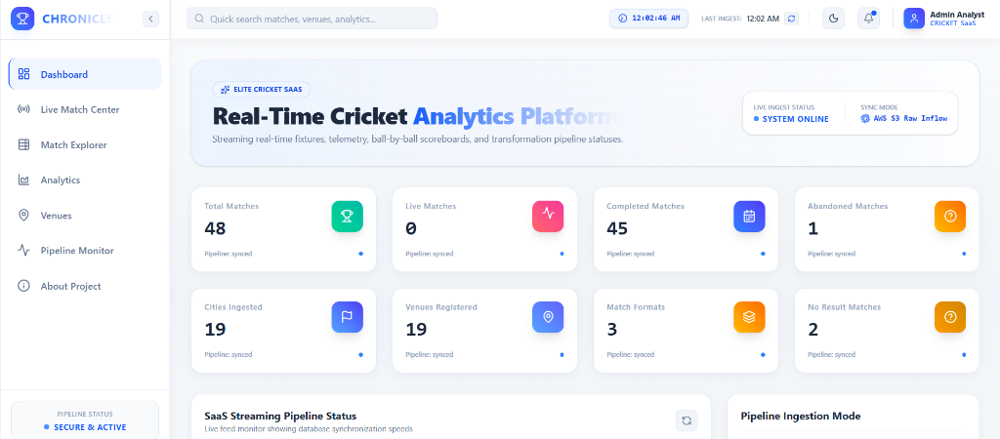

# 🛡️ Real-Time Cricket Telemetry Platform - Express API Backend


[](https://cricket-bd.vercel.app/api-docs)
[](https://nodejs.org/)
[](https://github.com/Vamsi-Kandregula/Real-Time-Cricket-Analytics-Platform/blob/main/sql/snowflake_setup.sql)

This is the Express API service that connects securely to the Snowflake Data Warehouse, queries the dbt analytical marts, and serves structured JSON feeds to the React frontend dashboard.

---

## 🔗 Live Endpoint Access
* **Interactive API Documentation**: [cricket-bd.vercel.app/api-docs](https://cricket-bd.vercel.app/api-docs) *(Swagger UI docs for API testing)*

---

## 📸 Interface Previews

### 📊 Main Dashboard Data


---

## ⚙️ Key Technical Features
* **Snowflake SDK Integration**: Uses connection pooling via `snowflake-sdk` to execute optimized queries against the Snowflake database.
* **REST Endpoints**:
  * `GET /api/dashboard` - Serves key aggregates (`TOTAL_MATCHES`, `LIVE_MATCHES`, `COMPLETED_MATCHES`, `ABANDONED_MATCHES`, `NO_RESULT_MATCHES`, etc.) from the dbt view `MART_DASHBOARD_SUMMARY`.
  * `GET /api/matches` - Serves clean match lists and schedules.
  * `GET /api/venues` - Serves venue stats and geographical hotspot coordinates.
* **Health Diagnostics**: `GET /health` runs instant query connectivity checks to ensure Snowflake connection handles are active.

---

## 🚀 Getting Started

### 1. Environment Setup
1. Copy the `.env.example` file to `.env`:
   ```bash
   cp .env.example .env
   ```
2. Open `.env` and fill in your Snowflake credentials:
   ```env
   PORT=5000
   NODE_ENV=development

   SNOWFLAKE_ACCOUNT=your_snowflake_account_id
   SNOWFLAKE_USERNAME=your_username
   SNOWFLAKE_PASSWORD=your_secure_password
   SNOWFLAKE_WAREHOUSE=your_warehouse_name
   SNOWFLAKE_DATABASE=your_database_name
   SNOWFLAKE_SCHEMA=your_schema_name
   SNOWFLAKE_ROLE=your_role_name
   ```

### 2. Running Locally
```bash
npm install
npm run dev
```
The server will start on `http://localhost:5000`. You can access the documentation at `http://localhost:5000/api-docs`.
